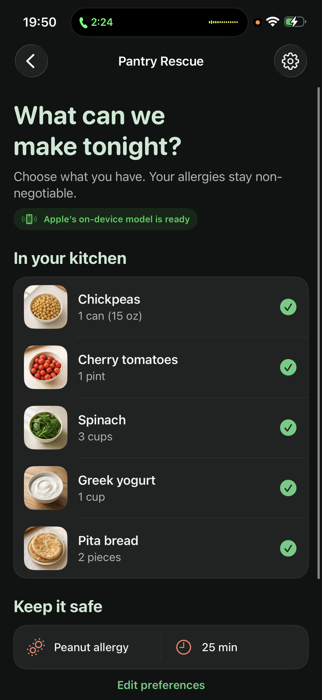
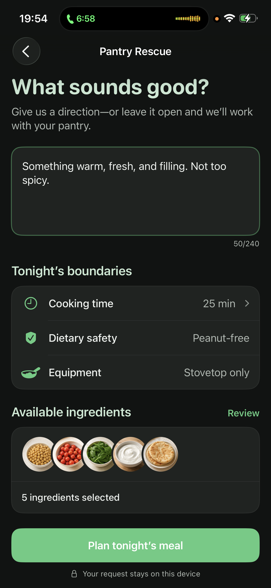
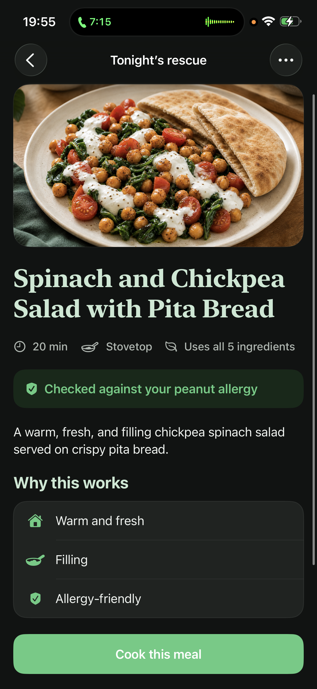
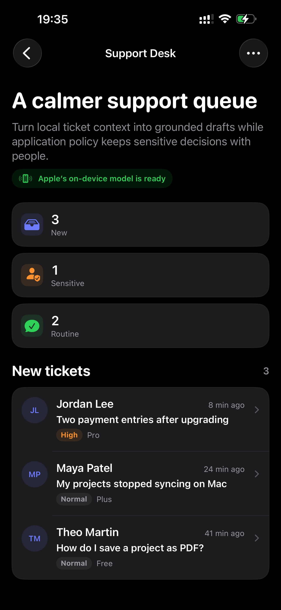
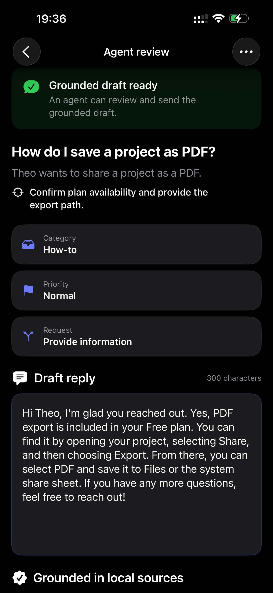
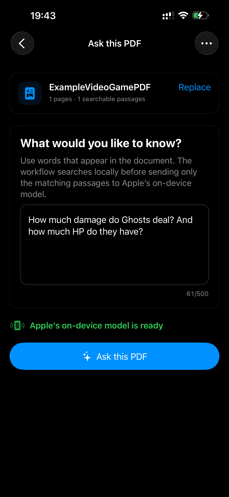
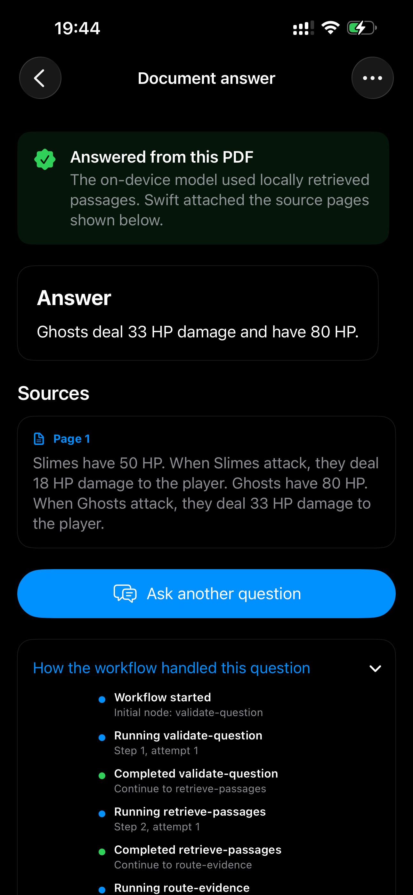

# SwiftOrc

`SwiftOrc` is a lightweight, strongly typed framework for building predictable,
local-first AI workflows in Swift.

It is designed around Apple's on-device Foundation Models while remaining
provider-neutral. Apps can use private, offline generation by default, then
explicitly route selected requests to OpenAI-compatible or custom external
providers when a task requires capabilities the local model cannot provide.

SwiftOrc adds orchestration around those models: typed workflow state,
validation, retries, fallback, tool policies, structured output, parallel work,
checkpointing, and privacy-conscious diagnostics.

## Local first, not local only

SwiftOrc's core runtime and Apple Foundation Models integration do not initiate
network requests. External model access is optional and must be configured by
the application through `SwiftOrcOpenAICompatible` or a custom model adapter.

The application remains in control of:

- whether network access is permitted;
- which requests may leave the device;
- which local or remote providers are eligible;
- the order in which providers are attempted;
- whether a deterministic fallback should be used;
- which tools may run automatically or require approval.

This supports fully offline apps as well as hybrid workflows that begin
on-device and escalate only when necessary.

## Examples

The included **SwiftOrc Demo** shows complete, user-facing workflows rather
than isolated model calls. Each example uses Apple's on-device model for a
focused task while ordinary Swift owns routing, validation, safety rules, and
fallback behavior.

### Pantry Rescue

Turn a mock pantry, dietary requirements, available equipment, and a time limit
into a checked meal plan. The model proposes a structured recipe; Swift verifies
that it uses the selected ingredients, respects the allergy and equipment rules,
fits the time limit, and either approves it, requests a bounded revision, or
uses a deterministic fallback. Pantry data never leaves the device.

<p align="center">
  
  
  
</p>

### Support Desk

Convert bundled mock ticket, account, and knowledge-base data into a grounded
reply for an agent to review. The model writes only the draft; application code
owns triage and checks grounding, prohibited claims, sensitive actions, and
reply quality. The demo never sends a message or changes an account.

<p align="center">
  
  
</p>

### PDF Knowledge

Choose a searchable PDF and ask questions whose answers must stay grounded in
that document. The app performs bounded PDFKit extraction and local retrieval,
sends only matching passages to the on-device model, and attaches page-aware
sources in Swift. The PDF is not uploaded, and the workflow stops rather than
guessing when it cannot find sufficient evidence.

<p align="center">
  
  
</p>

Reproduce the screenshots with the
[sample video-game PDF](Examples/SwiftOrcDemo/SampleDocuments/ExampleVideoGamePDF.pdf)
and ask: *How much damage do Ghosts deal, and how much HP do they have?*

[Explore the demo source and all included workflows](Examples/SwiftOrcDemo/README.md).

## Start with one workflow

The smallest workflow does not require a model, router, checkpoint store, tool,
or artifact store:

```swift
import SwiftOrc

struct AppState: Sendable {
    var value = 0
    var answer = ""
}

let increment = AnyWorkflowNode<AppState>(id: "increment") { state, _ in
    var state = state
    state.value += 1
    return .finish(state)
}

let workflow = try Workflow(
    initialNode: "increment",
    nodes: [increment]
)

let result = try await workflow.run(AppState())
```

## Installation

In Xcode, choose **File > Add Package Dependencies** and enter:

```text
https://github.com/chloke/SwiftOrc.git
```

Alternatively, add SwiftOrc to a Swift package:

```swift
dependencies: [
    .package(
        url: "https://github.com/chloke/SwiftOrc.git",
        from: "0.1.0"
    )
]
```

Add only the products a target needs:

```swift
.target(
    name: "MyApp",
    dependencies: [
        .product(name: "SwiftOrc", package: "SwiftOrc"),
        .product(name: "SwiftOrcFoundationModels", package: "SwiftOrc"),
    ]
)
```

`SwiftOrcOpenAICompatible` and `SwiftOrcTesting` are separate optional
products. Applications using only the core runtime do not need a model adapter.

## Add only what the app needs

Advanced behavior is opt-in and defaults to being absent:

| Need | Add |
| --- | --- |
| Model generation | `LanguageModelNode` |
| Typed JSON output | `StructuredLanguageModelNode` |
| Multiple providers | `LanguageModelRouter` |
| Model tools | `ToolCallingLanguageModel` |
| Tool approval UI | `LanguageModelToolApprovalCoordinator` |
| Images or generated files | A `WorkflowArtifactStore` |
| Crash-safe continuation | A checkpoint handler |
| Parallel work | `ParallelNode` |
| Incremental model output | `StreamingLanguageModelNode` |
| Stateful Apple conversation | `AppleFoundationModelConversation` |
| Developer graph UI | `workflow.declaredGraph` |
| Deterministic tests | The optional `SwiftOrcTesting` product |

For example, one model step needs only a model, request, and reducer:

```swift
let answer = LanguageModelNode<AppState>(
    id: "answer",
    model: model,
    request: { _, _ in
        LanguageModelRequest(prompt: "Explain this clearly.")
    },
    reduce: { response, state, _ in
        var state = state
        state.answer = response.content
        return .finish(state)
    }
)
```

`LanguageModelRequest(prompt:)` is sufficient for ordinary text generation.
Routing, capabilities, multimodal input, tools, and schemas all have empty or
automatic defaults.

## Products

- `SwiftOrc`: workflow and provider-neutral model APIs.
- `SwiftOrcFoundationModels`: Apple's on-device Foundation Models adapter.
- `SwiftOrcOpenAICompatible`: optional remote Chat Completions adapter.
- `SwiftOrcTesting`: optional scripted models and workflow probes for tests.

The package has no third-party runtime dependencies.

## Compatibility

The package supports deployment to iOS 16 or later and macOS 13 or later.
Individual products can have newer runtime requirements:

| Product | Runtime availability |
| --- | --- |
| `SwiftOrc` | iOS 16+, macOS 13+ |
| `SwiftOrcOpenAICompatible` | iOS 16+, macOS 13+ |
| `SwiftOrcTesting` | iOS 16+, macOS 13+ |
| `SwiftOrcFoundationModels` | iOS 26+, macOS 26+ |

An app supporting older operating systems can use the core framework and remote
providers, then select Apple's on-device model conditionally:

```swift
import SwiftOrcFoundationModels

if #available(iOS 26.0, macOS 26.0, *) {
    let model = AppleFoundationModel()
    // Build the on-device route.
} else {
    // Build a remote or deterministic fallback route.
}
```

These are deployment targets, not build-tool requirements. SwiftOrc uses
Swift tools 6.3, so consuming applications must be built with a compatible Swift
toolchain even when they deploy to iOS 16 or macOS 13.

## Versioning

SwiftOrc follows semantic versioning. Before 1.0, minor releases may refine
the public API as real applications exercise it; changes that require source
updates will be called out in `CHANGELOG.md`. Patch releases should remain
source-compatible and focus on fixes and documentation.

Applications should depend on a tagged release instead of a moving branch.

## Focused guides

- [Language models, routing, structured output, and images](Documentation/LanguageModels.md)
- [Tools, access policy, execution policy, and approvals](Documentation/Tools.md)
- [Validation, recovery, concurrency, tracing, and checkpoints](Documentation/Reliability.md)
- [Security model and application responsibilities](Documentation/Security.md)
- [Scope rules and complexity budget](Documentation/ScopeAndComplexity.md)
- [Testing workflows without providers](Documentation/Testing.md)
- [Example application](Examples/SwiftOrcDemo/README.md)

The framework intentionally does not provide domain-specific moderation, face
detection, character memory, news retrieval, or image-generation logic. Apps
compose those capabilities as nodes or optional external packages.

## Contributing

SwiftOrc is currently maintained as a single-author project and is not
accepting external code contributions. Bug reports and responsible security
reports remain welcome. See [CONTRIBUTING.md](CONTRIBUTING.md) and
[SECURITY.md](SECURITY.md).

## License

SwiftOrc is available under the MIT License. See [LICENSE](LICENSE) for details.
